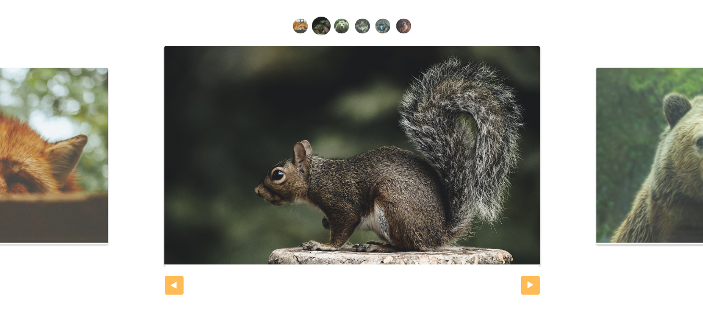

# Slide

Project developed in the JavaScript Completo ES6 course - [Origamid](https://www.origamid.com/curso/javascript-completo-es6/) - [Certificate](https://drive.google.com/file/d/1JHBtJiXVvI38YR4r4t-32_vVImI8nGxY/view).

The project uses JavaScript to create a Slide.

[Project webpage](https://kelwynoliveira.github.io/Slide/)

